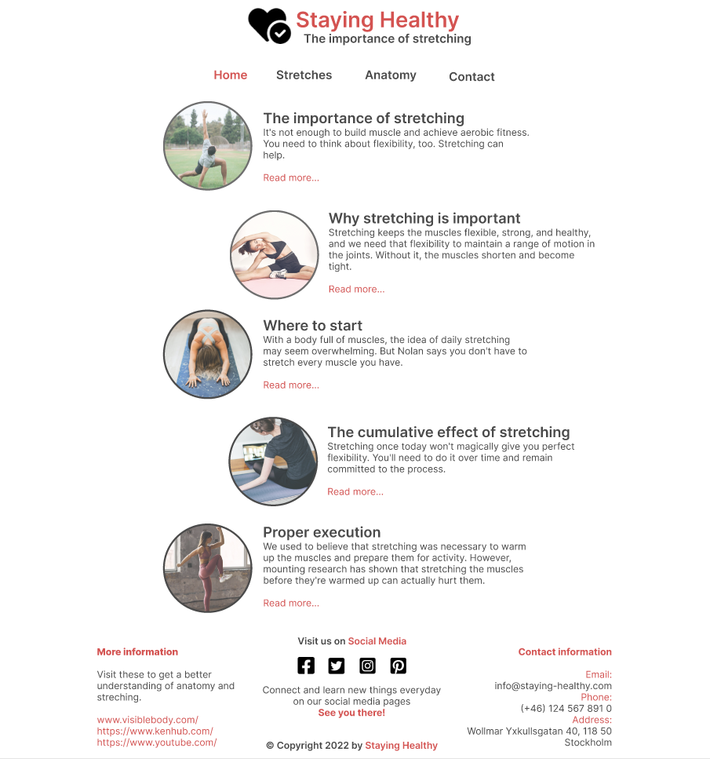
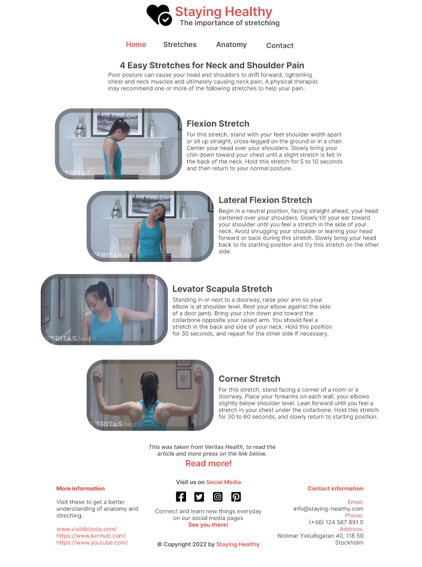
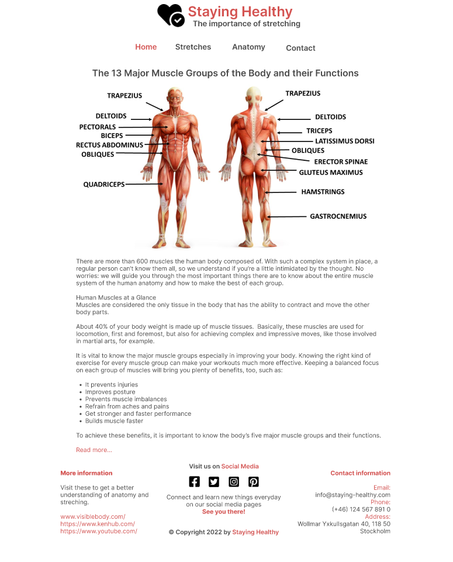
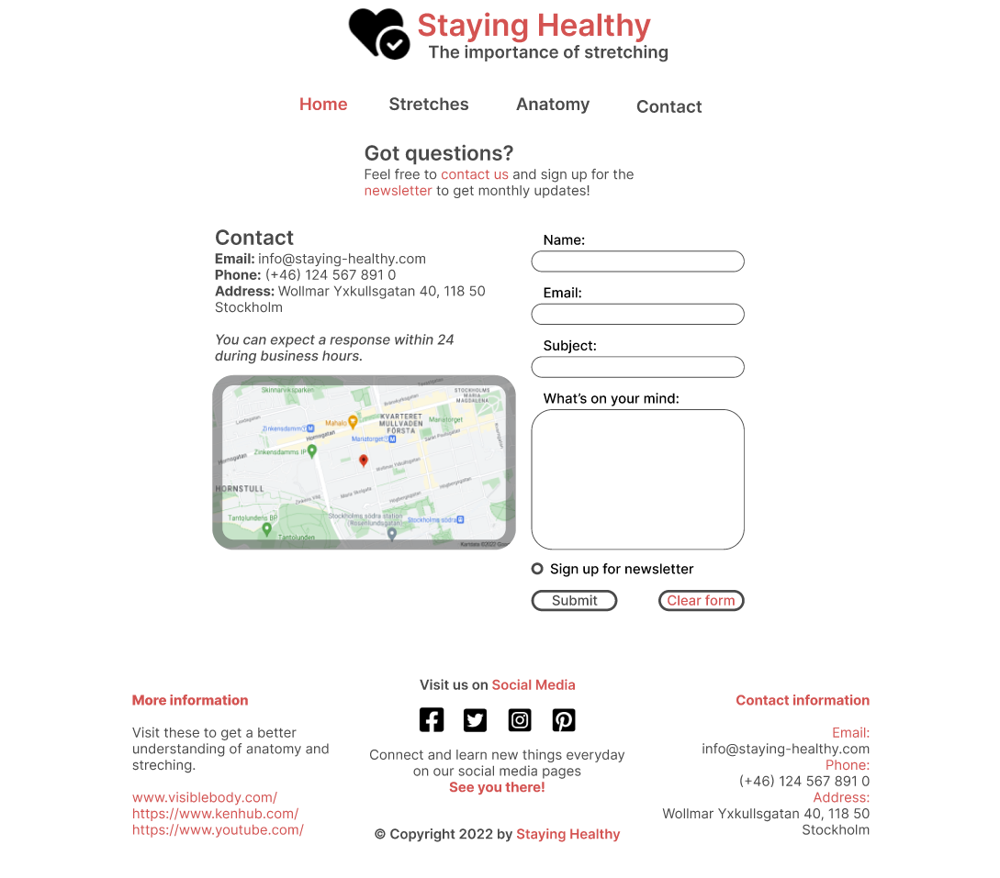

# Staying Healthy

Staying Healthy is for people's awareness of using stretching and the basic knowledge of anatomy, to get a better understanding how important it is for our health.

Here will you find the basic knowledge to get started on the journey of better understanding:

- **The importance of stretching** 
- **Basic neck stretches**
- **Anatomy major muscle groups**

The site is aimed at people who want to feel better and staying healthy.

# Table of contents

1. Placeholder
2. Placeholder
3. Placeholder

# UX

### Strategy

The Strategy for this site is to get people the basic knowledge of anatomy and about the importance of stretching. 

The target groups are:
- All Ages
- Users who want to know how to feel better and staying healthy
- Who want to get basic knowledge about major muscle groups

```
<u>This text will be removed, its just a guideline!</u>
What are you aiming to achieve in the first place, and for whom?
```

### Scope
The scope plane is that you will

```
<u>This text will be removed, its just a guideline!</u>
What features (based on information from the Strategy) do you want to include in your design? What's on the table and what's not. (at least for now)?
```

### Structure

<details><summary>Structure made with Balsamiq</summary>


</details>


```
<u>This text will be removed, its just a guideline!</u>
How is the information structured, and is it logically grouped?
```

### Skeleton
The skeleton sketches was made using [Balsamiq](https://www.balsamiq.com/)

<details><summary>Wireframe / Skeleton</summary>


</details>

```
<u>This text will be removed, its just a guideline!</u>
How the information should be implemented, and how will the user navigate throught the information/features?
```

### Surface
The surface sketches was made using [Figma](https://www.figma.com/)

Typography:
"Poppins" for Text
"Oswald" for Headers

Color scheme:

**#DC5454** <br>


**#4A4A4A** <br>


<details><summary>Home Page</summary>



</details>

<details><summary>Stretch Page</summary>



</details>

<details><summary>Anatomy Page</summary>



</details>

<details><summary>Contact Page</summary>



</details>

```
<u>This text will be removed, its just a guideline!</u>
What will the product look like, colors, typegraphy, images, design elements etc?
```

## <u>Features</u>

All the pages features a Logo, header with navigation and a footer.

Stylish Logo

- Header
    - Navigation bar that features easy to read content on where to find the different parts of the website.

- Footer

### <u>Main Page</u>

- Placeholder

### <u>Stretches</u>

- Placeholder

### <u>Anatomy</u>

- Placeholder

### <u>Contact / Newsletter</u>

- Placeholder


## Testing
```
<u>This text will be removed, its just a guideline!</u>
In this section, you need to convince the assessor that you have conducted enough testing to legitimately believe that the site works well. Essentially, in this part you will want to go over all of your project’s features and ensure that they all work as intended, with the project providing an easy and straightforward way for the users to achieve their goals.

In addition, you should mention in this section how your project looks and works on different browsers and screen sizes.

You should also mention in this section any interesting bugs or problems you discovered during your testing, even if you haven't addressed them yet.

If this section grows too long, you may want to split it off into a separate file and link to it from here.
```

## Validator Testing
```
<u>This text will be removed, its just a guideline!</u>
HTML
No errors were returned when passing through the official W3C validator
CSS
No errors were found when passing through the official (Jigsaw) validator
```
## Unfixed bugs
```
<u>This text will be removed, its just a guideline!</u>
You will need to mention unfixed bugs and why they were not fixed. This section should include shortcomings of the frameworks or technologies used. Although time can be a big variable to consider, paucity of time and difficulty understanding implementation is not a valid reason to leave bugs unfixed.
```

## Deployment
```
<u>This text will be removed, its just a guideline!</u>
This section should describe the process you went through to deploy the project to a hosting platform (e.g. GitHub)

The site was deployed to GitHub pages. The steps to deploy are as follows:
In the GitHub repository, navigate to the Settings tab
From the source section drop-down menu, select the Master Branch
Once the master branch has been selected, the page will be automatically refreshed with a detailed ribbon display to indicate the successful deployment.
The live link can be found here - https://code-institute-org.github.io/love-running-2.0/index.html
```

# Credits
From my mentor Oluwaseun Owonikoko advice and guidance, she showed me another student's README.md for this project that I took inspiration from
and made my own version from it:

- [Irishbecky91](https://github.com/Irishbecky91/survival-guild)

The main content came from these different sites:

## Content

- [Harvard Medical School](https://www.health.harvard.edu/staying-healthy/the-importance-of-stretching)
- [Veritas Health](https://www.spine-health.com/slideshow/slideshow-4-easy-stretches-neck-and-shoulder-pain?showall=true)
- [Elevate](https://www.elevatenutrition.com/13-major-muscle-groups-body-functions/)

- The Logo in the header and the social icons in the footer were taken from [Font Awesome](https://fontawesome.com/)
- The fonts used were taken from [Google Fonts](https://fonts.google.com/)
        
## Media

Home Page:

- [dex-ezekiel](https://unsplash.com/photos/We6cFKHo8sQ?utm_source=unsplash&utm_medium=referral&utm_content=creditShareLink)
- [Anastasia Hisel](https://unsplash.com/photos/tpivPdQgC20?utm_source=unsplash&utm_medium=referral&utm_content=creditShareLink)
- [LUNA ACTIVE FITNESS](https://unsplash.com/photos/O3AA1XfKofM?utm_source=unsplash&utm_medium=referral&utm_content=creditShareLink)
- [Kari Shea](https://unsplash.com/photos/qa1wvrlWCio?utm_source=unsplash&utm_medium=referral&utm_content=creditShareLink)
- [Julia Rekamie](https://unsplash.com/photos/2aHSA17X17c?utm_source=unsplash&utm_medium=referral&utm_content=creditShareLink)

Stretches:

- [Veritas Health](https://www.spine-health.com/slideshow/slideshow-4-easy-stretches-neck-and-shoulder-pain?showall=true)

Anatomy:

- [MooMooMath and Science](https://www.youtube.com/watch?v=z7psWfRLXFY)

## Tutorial / used code

- [w3c school - CSS Forms](https://www.w3schools.com/css/css_form.asp)
- [Google map generator](https://google-map-generator.com/)


## Main Language Used

- HTML5
- CSS3

