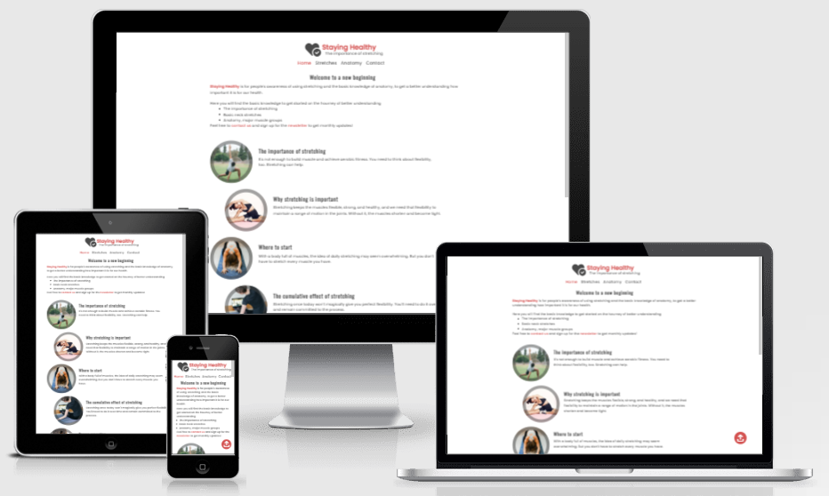
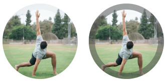

# Staying Healthy




<a href="https://jorgenbrattang.github.io/staying-healthy/" title="Link to live website" rel="nofollow">View live website here!</a>

Staying Healthy is for people's awareness of using stretching and the basic knowledge of anatomy, to get a better understanding how important it is for our health.

Here will you find the basic knowledge to get started on the journey of better understanding:

- **The importance of stretching** 
- **Basic neck stretches**
- **Anatomy major muscle groups**

The site is aimed at people who want to feel better and staying healthy.

<br>

# UX

### Development
Is to create a website that will get the user to get the fundamental understanding of human body and its movement. To do this the developer must research some basic knowledge of the human body and piece together a fundamental structure on how to inform other users with this information.

### Strategy

The Strategy for this site is to get people the basic knowledge of anatomy and about the importance of stretching. 

The target groups are:
- All Ages
- Users who want to know how to feel better and staying healthy
- Who want to get basic knowledge about major muscle groups

<br>

### Scope
The user will easly get ahold of the information to get them started on the journey to better understand the human body.

The features will be a page for:
- The importance of stretching, through images and article.
- Easy exercice for neck and shoulder stretches, through images and article.
- The major muscle groups, through video and an article.
- Contact page with form and location.

<br>

### Structure
The information and features was made into a easy to follow and read structure, with clear directions.


<details><summary>Structure made with Balsamiq</summary>


</details>

<br>

### Skeleton
The skeleton wireframe was made to give a clean and easy to use experiance. 

Made with [Balsamiq](https://www.balsamiq.com/)

<details><summary>Wireframe / Skeleton</summary>


</details>

<br>

### Surface
The design of from the skeleton stayed mostly the same, some changes were made to make it more pleasent to look at and make it more user friendly. With some input from my mentor and family. 

The surface was made with [Figma](https://www.figma.com/)

<details><summary>Home Page</summary>


</details>

<details><summary>Stretch Page</summary>


</details>

<details><summary>Anatomy Page</summary>


</details>

<details><summary>Contact Page</summary>


</details>

<br>

### Typography
To make the text more easy to read I ended up using [Poppins](https://fonts.google.com/specimen/Poppins?thickness=5&preview.text=You%20may%20think%20of%20stretching%20as%20something%20performed%20only%20by%20runners%20or%20gymnasts.%20But%20we%20all%20need%20to%20stretch%20in%20order%20to%20protect%20our%20mobility%20and%20independence.%20%22A%20lot%20of%20people%20don%27t%20understand%20that%20stretching%20has%20to%20happen%20on%20a%20regular%20basis.%20It%20should%20be%20daily,%22%20says%20David%20Nolan,%20a%20physical%20therapist%20at%20Harvard-affiliated%20Massachusetts%20General%20Hospital.&preview.size=17&preview.text_type=custom&query=Poppins)
 for the paragraphs and 
and [Oswald](https://fonts.google.com/specimen/Oswald?thickness=5&preview.text=You%20may%20think%20of%20stretching%20as%20something%20performed%20only%20by%20runners%20or%20gymnasts.%20But%20we%20all%20need%20to%20stretch%20in%20order%20to%20protect%20our%20mobility%20and%20independence.%20%22A%20lot%20of%20people%20don%27t%20understand%20that%20stretching%20has%20to%20happen%20on%20a%20regular%20basis.%20It%20should%20be%20daily,%22%20says%20David%20Nolan,%20a%20physical%20therapist%20at%20Harvard-affiliated%20Massachusetts%20General%20Hospital.&preview.size=17&preview.text_type=custom&query=oswald)
 for header, and Sans-Serif as backup incase the other fonts don't work.

<br>

### Color scheme
Was made to make the text more user friendly.

**#DC5454** <br>


**#4A4A4A** <br>


## <u>Features</u>

All the pages features a stylish logo that shows the sites name <strong>"Staying Healthy"</strong> and slogan <strong>"The importance of stretching"</strong>.
    
- <strong>Navigation bar</strong> that features easy to read and where to find the different parts of the website. This resizes with the website and doesn't change in shape.

- <strong>Footer</strong> is 800px wide as the site and will keep it size until the user goes below 525px, it will make the three text field stack ontop of each other.

- <strong>Image / map</strong> feature fade in outline screenshoot:
<br><br>

<br>

### <u>Main Page</u>

- <strong>Main text</strong>, that holds the welcome message and what the site is all about.
    - Stays the same at all screen sizes.
- <strong>Circle images</strong> shows people preforming stretches.
    - Features an outline fade in effect to the right opacity. 
        - The placement will change when the screensize is below 700px to be above the text rather next to it.
- <strong>Circle text</strong> holds parts of the article.
    - The placement will change when the screensize is below 700px to be below the text rather next to it.
- <strong>Read more</strong>, holds credit text where the article was taken from.
    - Stays the same at all screen sizes.

### <u>Stretches</u>

- <strong>Main text</strong>, that holds the intro text to this page.
    - Stays the same at all screen sizes.
- <strong>Square images</strong> shows images how the stretch is made.
    - Features an outline fade in to the right opacity. 
        - The placement will change when the screensize is below 700px to be above the text rather next to it.
- <strong>Square text</strong> discribes how to preform the stretch.
    - The placement will change when the screensize is below 700px to be below the text rather next to it.
- <strong>Read more</strong>, credit text where the article was taken from.
    - Stays the same at all screen sizes.

### <u>Anatomy</u>

- <strong>Video</strong> that shows information about the major muscles system. 
    - Features an fade in effect to the right opacity and a scale from 0 to 1. 
        - Scales with the site.
- <strong>Main text</strong> that holds the shorten version of an article.
    - Stays the same at all screen sizes.
- <strong>Read more</strong> credit text where the article was taken from and to read the full version.
    - Stays the same at all screen sizes.

### <u>Contact</u>

- <strong>Main text</strong> that holds the intro text to this page. 
    - Changes when the screensize is below 700px to fit the entire width of the page.
- <strong>Contact</strong> holds the information to contact.
    - Features an unsorted list. 
        - Changes when the screensize is below 700px to fit the entire width of the page.
- <strong>Map</strong> that shows where the location with help from google maps.
    - Features an fade in effect to the right opacity. 
        - Changes when the screensize is below 700px to fit the entire width of the page.
- <strong>Contact form</strong> where the user can contact and sign up for a newsletter.
    - Features a submit and clear form button. 
        - Changes when the screensize is below 700px to fit the entire width of the page.

## Testing

Found a bug when resizing the size of the screens height. It made the footer float far above the bottom of the page.
- Fixed by changing the footer from the section to its own place within the HTML and adding a display flex and column to the body.
```
<u>This text will be removed, its just a guideline!</u>
In this section, you need to convince the assessor that you have conducted enough testing to legitimately believe that the site works well. Essentially, in this part you will want to go over all of your project’s features and ensure that they all work as intended, with the project providing an easy and straightforward way for the users to achieve their goals.

In addition, you should mention in this section how your project looks and works on different browsers and screen sizes.

You should also mention in this section any interesting bugs or problems you discovered during your testing, even if you haven't addressed them yet.

If this section grows too long, you may want to split it off into a separate file and link to it from here.
```

## Validator Testing
Ran through all the code and no errors were found.

**HTML**
- No errors were returned when passing through the official [W3C validator](https://validator.w3.org/)

**CSS**
- No errors were found when passing through the official [(Jigsaw) validator](https://jigsaw.w3.org/css-validator/)

## Unfixed bugs
```
<u>This text will be removed, its just a guideline!</u>
You will need to mention unfixed bugs and why they were not fixed. This section should include shortcomings of the frameworks or technologies used. Although time can be a big variable to consider, paucity of time and difficulty understanding implementation is not a valid reason to leave bugs unfixed.
```

# Technologies Used

## Main Language Used

- HTML5
- CSS3

## Frameworks, Libraries & Programs Used

- Google Fonts
    - Google fonts was used to import the fonts "Special Elite", "Open Sans", "Oswald" and "Nosifer" into the style.css file. These fonts were used throughout the project.
- Font Awesome
    - Font Awesome was used on almost all pages throughout the website to import icons (e.g. social media icons) for UX purposes.
- GitPod
    - GitPod was used for writing code, commiting, and then pushing to GitHub.
- GitHub
    - GitHub was used to store the project after pushing
- Balsamiq
    - Balsamiq was used to create the wireframes during the design phase of the project.
- Figma
    - Figma was used to create the concept art during the design phase of the project.
- Am I Responsive?
    - Am I Responsive was used in order to see responsive design throughout the process and to generate mockup imagery to be used.

## Deployment
To deploy this page to GitHub Pages from its GitHub repository, the following steps were taken:

1. Log into <a href="https://github.com/login" title="Link to GitHub login" rel="nofollow">GitHub</a> or <a href="(https://github.com/join)" title="Link to GitHub join" rel="nofollow">Create an account</a>.
2. Locate the <a href="https://github.com/JorgenBrattang/staying-healthy" title="Link to GitHub Repository" rel="nofollow">GitHub Repository</a>.
3. At the top of the repository, select Settings from the menu items.
4. Scroll down the Settings page to the "Pages" section.
5. Under "Source" click the drop-down menu labelled "None" and select "Main".
6. Upon selection, the page will automatically refresh meaning that the website is now deployed.
7. Scroll back down to the "Pages" section to retrieve the deployed link.

# Credits

## Content
The main content came from these different sites:

- [Harvard Medical School](https://www.health.harvard.edu/staying-healthy/the-importance-of-stretching)
- [Veritas Health](https://www.spine-health.com/slideshow/slideshow-4-easy-stretches-neck-and-shoulder-pain?showall=true)
- [Elevate](https://www.elevatenutrition.com/13-major-muscle-groups-body-functions/)

- The Logo in the header and the social icons in the footer were taken from [Font Awesome](https://fontawesome.com/)
- The fonts used were taken from [Google Fonts](https://fonts.google.com/)
        
## Media

README:
- [Am I Responsive](https://amiresponsive.blogspot.com/)

Home Page:

- [dex-ezekiel](https://unsplash.com/photos/We6cFKHo8sQ?utm_source=unsplash&utm_medium=referral&utm_content=creditShareLink)
- [Anastasia Hisel](https://unsplash.com/photos/tpivPdQgC20?utm_source=unsplash&utm_medium=referral&utm_content=creditShareLink)
- [LUNA ACTIVE FITNESS](https://unsplash.com/photos/O3AA1XfKofM?utm_source=unsplash&utm_medium=referral&utm_content=creditShareLink)
- [Kari Shea](https://unsplash.com/photos/qa1wvrlWCio?utm_source=unsplash&utm_medium=referral&utm_content=creditShareLink)
- [Julia Rekamie](https://unsplash.com/photos/2aHSA17X17c?utm_source=unsplash&utm_medium=referral&utm_content=creditShareLink)

Stretches:

- [Veritas Health](https://www.spine-health.com/slideshow/slideshow-4-easy-stretches-neck-and-shoulder-pain?showall=true)

Anatomy:

- [MooMooMath and Science](https://www.youtube.com/watch?v=z7psWfRLXFY)

## Tutorial / used code

- [w3c school - CSS Forms](https://www.w3schools.com/css/css_form.asp)
- [Google map generator](https://google-map-generator.com/)

# Acknowledgements
From my mentor <a href="https://github.com/seunkoko" title="Link to GitHub profile" rel="nofollow">Oluwaseun Owonikoko</a> advice and guidance, she shared her knowledge and gave me insight and ideas to get the most of my website. She also showed me another student README.md for this project, <a href="https://github.com/Irishbecky91/survival-guild" title="Link to Irishbecky91 repository" rel="nofollow">Irishbecky91</a> that I took inspiration from. Irishbecky91 had such good structure that gave my README an awesome baseline to use and continue to grow from for my future projects.
