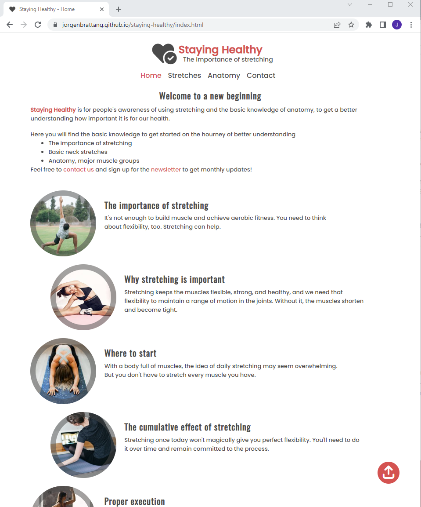
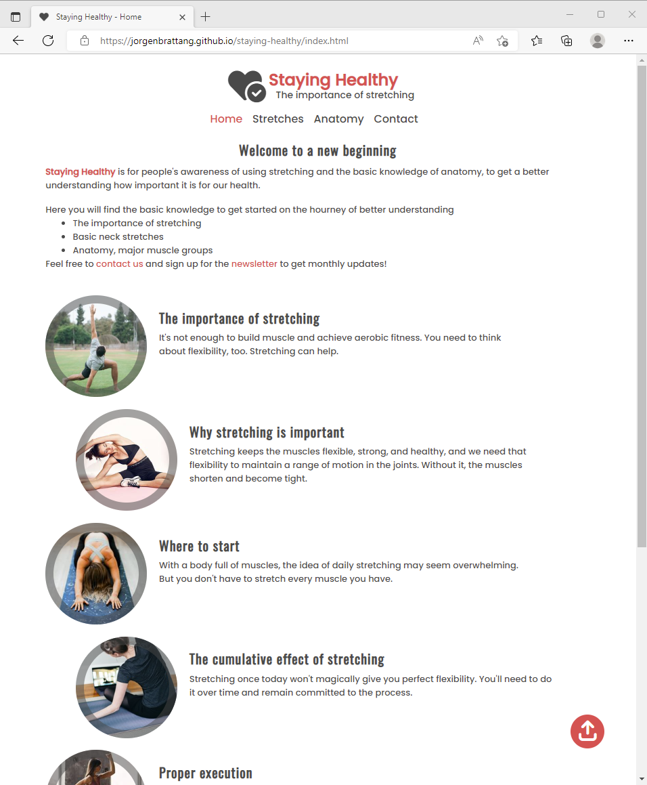
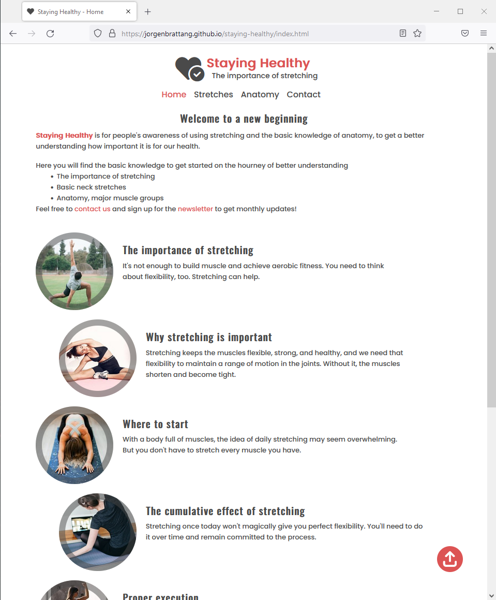
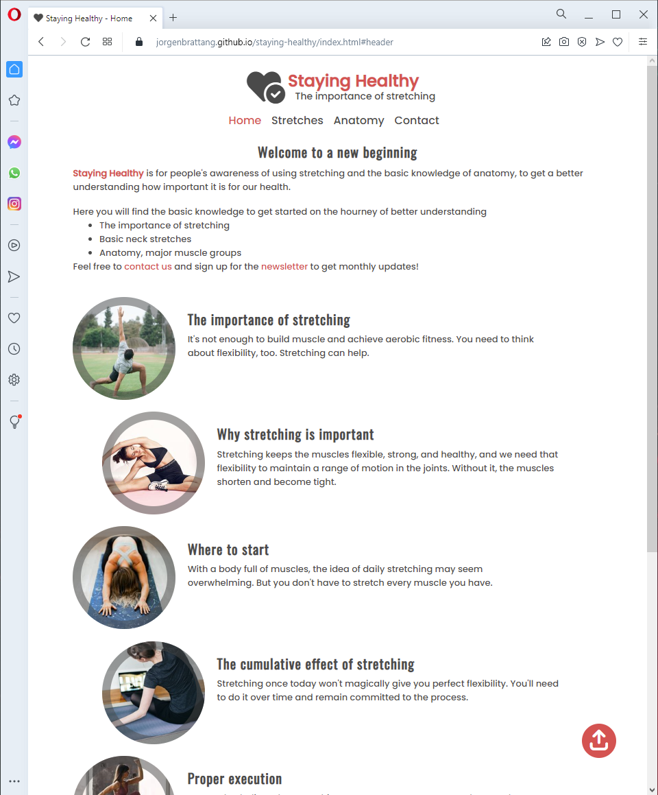

# Links
- <a href="https://github.com/JorgenBrattang/staying-healthy" target="_blank">Github Repository</a>
- <a href="https://github.com/JorgenBrattang/staying-healthy/blob/main/README.md" target="_blank">README.md</a>
- <a href="https://jorgenbrattang.github.io/staying-healthy/" title="Link to live website" rel="nofollow" target="_blank">View live website here!</a>

# Feature testing
## <u>Video responsive test with free resizing and three screens iPhone SE, iPad Air and Nest Hub.</u>

Home (index.html)

Stretches (stretches.html)

Anatomy (anatomy.html)

Contact (contact.html) - (contact-dump.html uses the same code but without form, no test needed)

 

## Features within the website
- Back to top button feature, works as intended. It gets you back to the top of the page, and when you hover over it it changes color.

Back to top feature video

- Favicon feature, works as intended. It shows a heart next to the title of the website

Favicon feature video

- Footer links feature, works as intended. When hovering the the links, they change color to give feedback that they are links and will open up a new tab when pressed upon.

Footer links video

- Contact form feature, works as intended. It gives you clear instructions on what's needed to fill out the form, and when submitted it gives you an confirmation that the form has been submited.

Contact form feature video

- Google Map feature, works as intended. It shows you the location and its fully functional.

Google map feature video

- Images fading and hover feature, works as intended. When entering the site the border of the images fade in and when hovering them they give a more clear color.

Images fading and hover feature video

- Navigation bar feature, works as intended. When you press on each navigation link they move you to different site within the website, and gives you an hover effect plus an active feature when you are in "Anatomy" for example the name is highlighted.

Images fading and hover feature video

- Read more feature, works as intended. When hovering it will change color and once you press on it will open a new tab where the full article is found.

Read more feature video/summary>

- Video feature, works as intended. When entering the page the video will fade in and load, it will not play by it self nor with any audio. User has full control of the video.

Video feature video

 

## Bug reports

The developer ran into few problems along the way of developing the website, the problems worth mentioning are the responsive side of the website. 

Bug found when resizing the size of the screens height. It made the footer float far above the bottom of the page.
- <strong style="color:#71F57E;">Problem solved</strong>, by changing the footer from the section to its own place within the HTML and adding a display flex and column to the body.

### Slack #peer-code-review
- Carina Stenger
    - "After submitting the form the line ‚have a nice day‘ could use a bit more padding (checked on an iphone SE)"
        - <strong style="color:#71F57E;">Problem solved</strong>, by changing the media queiry for that size of phone.

- Hannah Carey_5p
    - "Issue I found was on the form validation page. The text is hidden by the google maps location on my screen.
        - <strong style="color:#71F57E;">Problem solved</strong>, by changing the div containing the map to auto instead of procent and make the map fixed height.

### <u>Websites on different browsers

Chrome

Edge

Firefox

Opera

## <u>Validator Testing</u>
Ran through all the code and no errors were found.

**HTML**
- No errors were returned when passing through the official [W3C validator](https://validator.w3.org/)

**CSS**
- No errors were found when passing through the official [(Jigsaw) validator](https://jigsaw.w3.org/css-validator/)